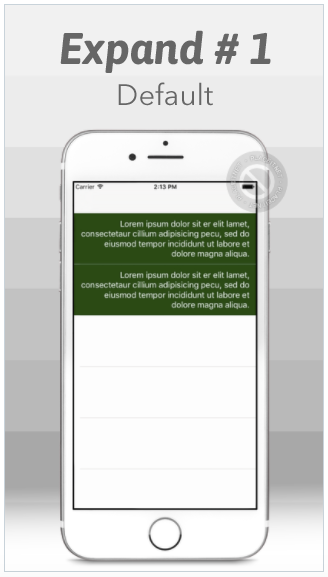
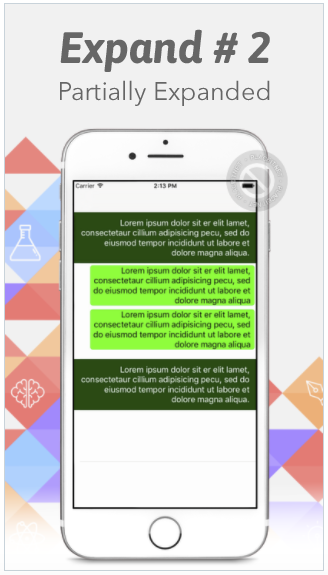
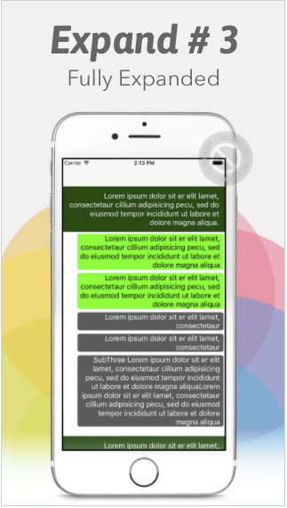

# ExpandableTable

## Preview
 
 

## Note

 `ExpandableTable`is an open source project just to demonstrate how to create a multiple expanding tableview.

## Author

gokul, gokulece26@gmail.com

## Social

  * [Facebook](https://www.facebook.com/gokul.rockzz.1)
  * [Twitter](https://twitter.com/gokulgovind_)
  * [StackOverflow](http://stackoverflow.com/users/5582022/gokul?tab=profile)
  * [Linkedin](https://www.linkedin.com/in/gokul-govind-1b0232105?trk=nav_responsive_tab_profile)

## License

ExpandableTable is available under the MIT license. See the LICENSE file for more info.
